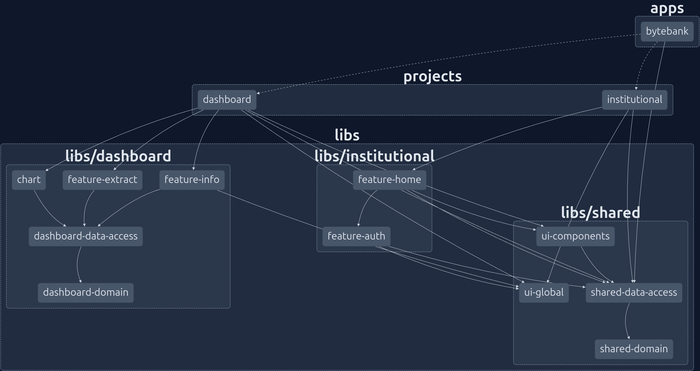
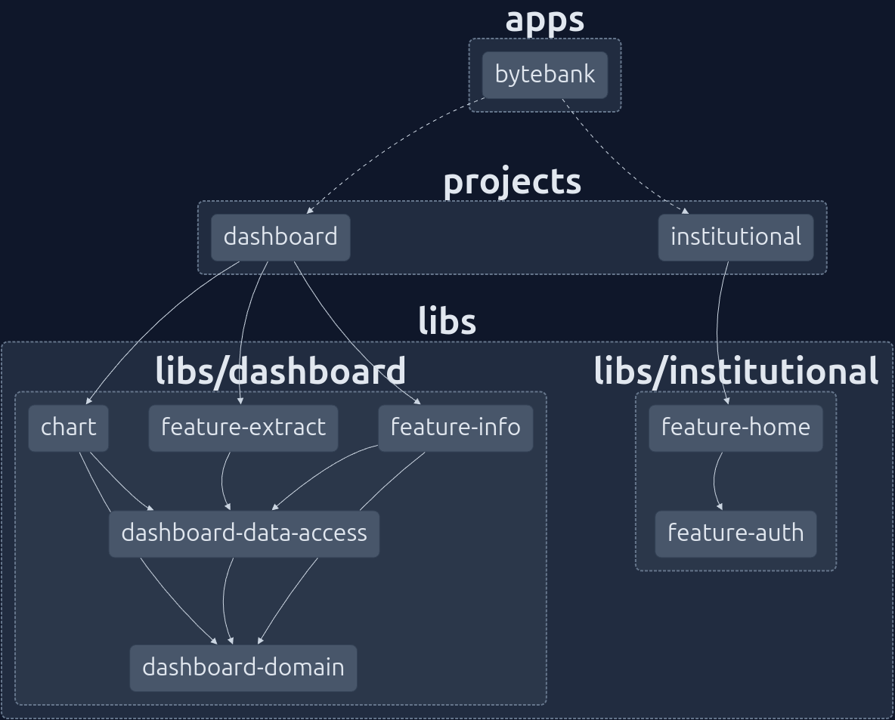
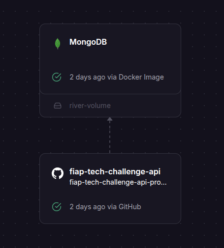

# Bytebank - Tech Challenge FIAP 2

Bem-vindo ao repositório do projeto **Bytebank**, desenvolvido como parte do "Tech Challenge FIAP - 2". Este projeto implementa uma aplicação modular baseada em microfrontends utilizando **Module Federation**, gerenciada pelo orquestrador **Nx**, e construída com **Angular 19**, seguindo as melhores práticas de arquitetura e desenvolvimento frontend modernas.

O objetivo do projeto é demonstrar uma solução escalável e modular, com separação clara de responsabilidades entre o host e os remotes (microfrontends), utilizando uma arquitetura em camadas dentro de bibliotecas reutilizáveis (`libs`).

## Estrutura do Projeto

O projeto é composto por:
- **Host**: Aplicação principal chamada `Bytebank`, responsável por carregar os microfrontends.
- **Remotes (Microfrontends)**:
  - `institutional`: Configurado com **Server-Side Rendering (SSR)** para melhor performance e SEO.
  - `dashboard`: Interface voltada para visualização de dados e interações dinâmicas.
- **Libs**: Bibliotecas organizadas em escopos para promover reutilização e separação de interesses.

O gerenciamento do monorepo é feito com o **Nx**, que facilita a construção, testes e deploy das aplicações e bibliotecas.

### Diretórios Principais
- **📂`apps/`**: Contém o host principal (`bytebank`).
- **📂`projects/`**: Contém os microfrontends (`institutional`, `dashboard`).
- **📂`libs/`**: Contém as bibliotecas organizadas por escopo:
  - `shared`: Recursos compartilhados entre todos os módulos.
  - `institutional`: Lógica específica do microfrontend `institutional`.
  - `dashboard`: Lógica específica do microfrontend `dashboard`.

Dentro de cada escopo em `libs`, as camadas são divididas em:

- **📂 `data-access`**: Responsável por abstrair o acesso a dados, incluindo chamadas à API e gerenciamento de estado.
  Estruturada em:
    - infrastructure/: Contém os repositories que realizam as chamadas HTTP e GraphQL.
    - application/: Contém os facades, que encapsulam a lógica de gerenciamento de estado e comunicação com os repositórios.
  
- **📂`domain`**: Define modelos, interfaces e regras de negócio agnósticas à tecnologia.
- **📂`feature`**: Contém componentes e lógicas específicas de funcionalidades do negócio.
- **📂`ui`**: Componentes visuais reutilizáveis, focados exclusivamente na apresentação.

Essa estrutura segue os princípios de **Domain-Driven Design (DDD)** e **Clean Architecture**, promovendo modularidade e facilidade de manutenção.

## Arquitetura de Microfrontends com Nx

O projeto Bytebank é uma aplicação baseada em microfrontends, onde cada módulo é desenvolvido, testado e implantado de forma independente, permitindo escalabilidade e manutenção facilitada.
Na imagem abaixo, é possível visualizar a arquitetura do projeto, com o host `Bytebank` orquestrando os remotes `Institutional` e `Dashboard`:


Nesta imagem é possível observar o comportamento isolado dos remotes sem o compartilhamento da lib `shared`:


A api possui um banco de dados MongoDB (com docker docker em dev) e um servidor GraphQL para autenticação e um servidor REST para transações.


## Tecnologias Utilizadas

- **Angular 19**: Framework principal para construção das aplicações, utilizando recursos modernos como Signals para gerenciamento de estado reativo.
- **Nx**: Orquestrador de monorepo para gerenciamento eficiente de dependências, builds e testes.
- **Module Federation**: Tecnologia do Webpack para integração dinâmica dos microfrontends.
- **GraphQL**: Utilizado para requisições de autenticação, garantindo flexibilidade e eficiência.
- **REST**: Usado para requisições relacionadas a transações, com endpoints otimizados.
- **Server-Side Rendering (SSR)**: Implementado no microfrontend `institutional` para melhorar performance e SEO.

## Arquitetura e Implementação

### Microfrontends
Os microfrontends são carregados dinamicamente pelo host `Bytebank` utilizando **Module Federation**. Isso permite que cada módulo seja desenvolvido, testado e implantado de forma independente, mantendo a coesão da aplicação como um todo.

- **Host (`bytebank`)**: Não contém lógica interna, apenas orquestra o carregamento dos remotes.
- **Remote (`institutional`)**: Configurado com SSR para renderização no servidor, ideal para páginas institucionais públicas.
- **Remote (`dashboard`)**: Interface dinâmica para usuários autenticados, com foco em interatividade.

### Camadas nas Bibliotecas (`libs`)
As bibliotecas seguem uma abordagem em camadas para garantir separação de responsabilidades:

- **`data-access`**:
  - **Infraestrutura**: Contém os repositórios (ex.: `nome.repository.ts`), responsáveis por realizar chamadas às APIs. Autenticação utiliza GraphQL, enquanto transações utilizam REST.
  - **Aplicação**: Contém fachadas (ex.: `nome.facade.ts`), que gerenciam o estado dos componentes usando **Signals** do Angular e abstraem as chamadas aos repositórios.
- **`domain`**: Define entidades e tipos de dados, como modelos de transações ou usuários, sem dependências externas.
- **`feature`**: Implementa funcionalidades específicas, como listagem de transações ou formulários de autenticação.
- **`ui`**: Componentes de apresentação reutilizáveis, como botões, tabelas e cards.

### Gerenciamento de Estado
O estado dos componentes é gerenciado de forma reativa utilizando **Signals**, introduzidos no Angular 16 e aprimorados no Angular 19. As fachadas (`facade.ts`) centralizam a lógica de estado e comunicação com os repositórios, seguindo o padrão **Facade Pattern**.

## Como Executar o Projeto

### Pré-requisitos
- Node.js (versão 20.x ou superior)
- Nx CLI (`npm install -g nx`)
- Dependências do projeto (`npm install`)

### Passos

1. Instale as dependências:
   ```bash
   npm install

2. Execute o projeto pincipal em desenvolvimento (`bytebank`):
   ```bash
   npm run start:dev
   ```
3. Execute o host e os remotes:
  - Host (`bytebank`):
    ```bash
    nx serve bytebank
    ```
  - Para apenas o remote (`institutional`):
    ```bash
    nx serve institutional
    ```
  - Para apenas o remote (`dashboard`):
    ```bash
    nx serve dashboard
    ```
4. Acesse a aplicação em `http://localhost:4200`.
- Host: `http://localhost:4200`
- Remote (`institutional`): `http://localhost:4201`
- Remote (`dashboard`): `http://localhost:4202`

## Boas Práticas Adotadas
- **Modularidade**: Uso de microfrontends e bibliotecas para escalabilidade.
- **Separação de Responsabilidades**: Lógica abstraída nas camadas de `libs`, sem poluição nos hosts.
- **Reatividade**: Uso de Signals para um gerenciamento de estado moderno e eficiente.
- **Performance**: SSR no `institutional` para otimizar carregamento inicial.
- **Tipagem Forte**: Uso de TypeScript em todo o projeto para garantir robustez.

## Referências
- [Documentação Oficial do Angular](https://angular.dev/)
- [Nx - Smart Monorepos](https://nx.dev/)
- [Module Federation - Webpack](https://webpack.js.org/concepts/module-federation/)
- [Signals no Angular](https://angular.dev/guide/signals)
- [GraphQL Official](https://graphql.org/)
- [Clean Architecture - Robert C. Martin](https://blog.cleancoder.com/uncle-bob/2012/08/13/the-clean-architecture.html)
